# **Guilty Sheep - Join the Heard**

## **Introduction**

Guilty Sheep is a trendsetting e-commerce platform dedicated to offering unique, stylish products curated from various categories, collections, and artists. Guilty Sheep aims to provide a seamless shopping experience with user-friendly navigation, efficient purchasing options, and personalized user profiles.

*Welcome to [Guilty Sheep](https://guilty-sheep-d1a7abf9637c.herokuapp.com)*

# **Contents**

- [**Guilty Sheep - Join the Heard**](#guilty-sheep---your-trendy-e-commerce-haven)
    - [**Introduction**](#introduction)
- [**Contents**](#contents)
- [**User Experience (UX)**](#user-experience-ux)
    - [**User Stories**](#user-stories)
    - [**Wireframes**](#wireframes)
    - [**Site Structure**](#site-structure)
  - [**Design**](#design)
- [**Features**](#features)
  - [**Existing features**](#existing-features)
  - [**Technologies Used**](#technologies-used)
- [**Testing**](#testing)
- [**Deployment**](#deployment)
- [**Credits**](#credits)
- [**Acknowledgements**](#acknowledgements)

# **User Experience (UX)**

## **User Stories**

- **Viewing and Navigation:**
    - As a user, I want to view a list of products, so I can browse through available items.
    - As a user, I want to view a specific category, collection, or artist, so I can find products that suit my preferences.
    - As a user, I want to view individual product details, so I can learn more about the item before purchasing.
    - As a user, I want to view the total of my purchases at any time, so I can keep track of my spending.
    
- **Registration and User Access:**
    - As a new user, I want to easily register, so I can create an account and start shopping.
    - As a returning user, I want to log in or log out effortlessly, so I can access my account securely.
    - As a user, I want to recover my password if forgotten, so I do not lose access to my account.
    - As a user, I want to receive an email confirmation upon registration, so I know that my account has been successfully created.
    - As a user, I want a personalized user profile, so I can view and manage my account details and purchase history.

- **Sorting and Searching:**
    - As a user, I want to sort products by various criteria (e.g., price, popularity), so I can easily find what I am looking for.
    - As a user, I want to filter products based on attributes (e.g., size, color), so I can narrow down my choices.
    - As a user, I want to search for products by keywords, so I can quickly locate specific items.
    
- **Purchasing and Checkout:**
    - As a user, I want to select a product, size, and quantity, so I can add the correct items to my cart.
    - As a user, I want to view items in my shopping bag, so I can review my selections before checkout.
    - As a user, I want to adjust the quantity or remove items from my shopping bag, so I can modify my purchase as needed.
    - As a user, I want to enter my payment information securely, so I can complete my purchase.
    - As a user, I want to see an order confirmation on the site and receive an email confirmation, so I know my order has been successfully placed.

- **Wishlisting products**
    - As a user, I want to wishlist a product that I wish to buy in the future, so I can easily access it later.
    - As a user, I want to see a list of my wishlisted items, so I can keep track of the products I plan to buy.
    - As a user, I want to manage my wishlisted items (edit or delete), so I can update or remove any product as necessary.
    - As a user, I want to easily add products from my wishlist to my bag, so I can buy them when I am ready.

- **Reviewing Products:**
    - As a user, I want to add a review for a product, so I can share my experience with other customers.
    - As a user, I want to see a list of my reviews in my profile, so I can keep track of the products I have reviewed.
    - As a user, I want to manage my reviews (edit or delete), so I can update or remove my feedback as necessary.

- **Admin and Moderation:**
    - As an admin, I want to manage products (add, edit, delete), so I can keep the product listings up to date.
    - As an admin, I want to manage reviews, so I can moderate content and ensure a positive user experience. 

[Back to top](#contents)

## **Wireframes**

The wireframes for Guilty Sheep were produced in [Wireframe.cc](https://wireframe.cc). Inclued below, frames can be found for all distinct pages (home, rules, board) in desktop, mobile and tablet view as they were initially envisioned.

- Home Page

    - *Laptop*

    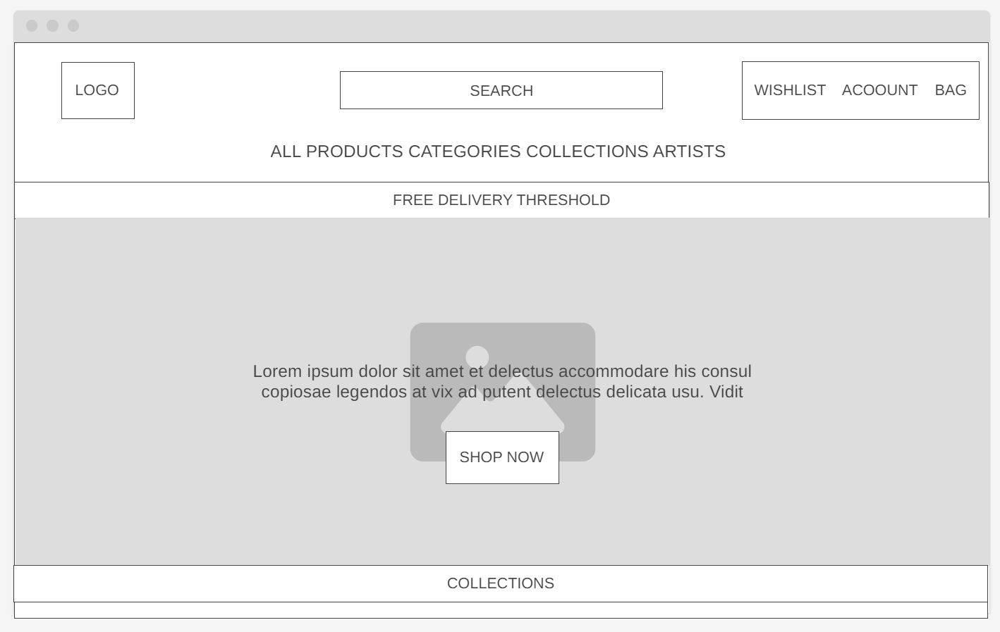

    - *Tablet*

    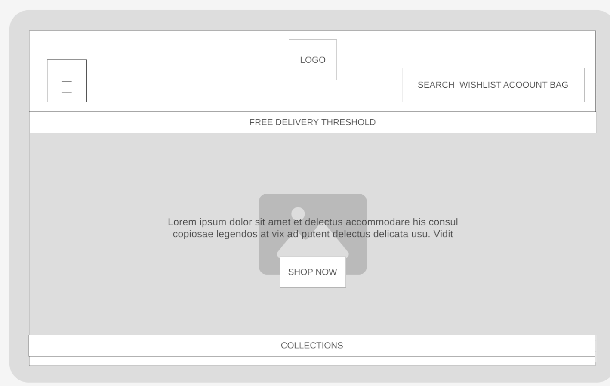

    - *Mobile*
    
    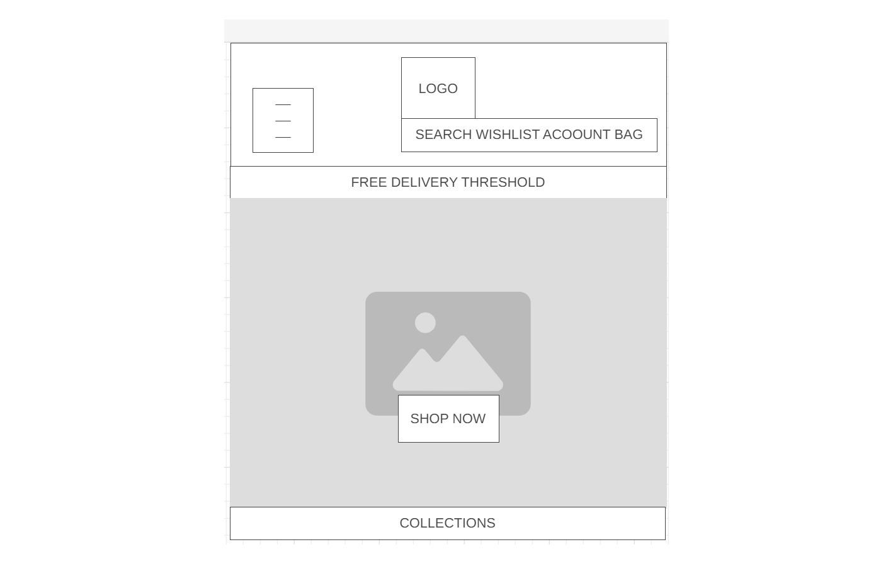

- Products Page

    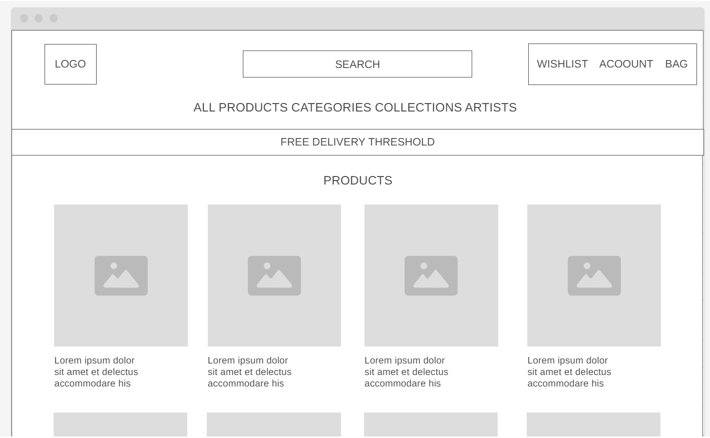

- Product Details Page

    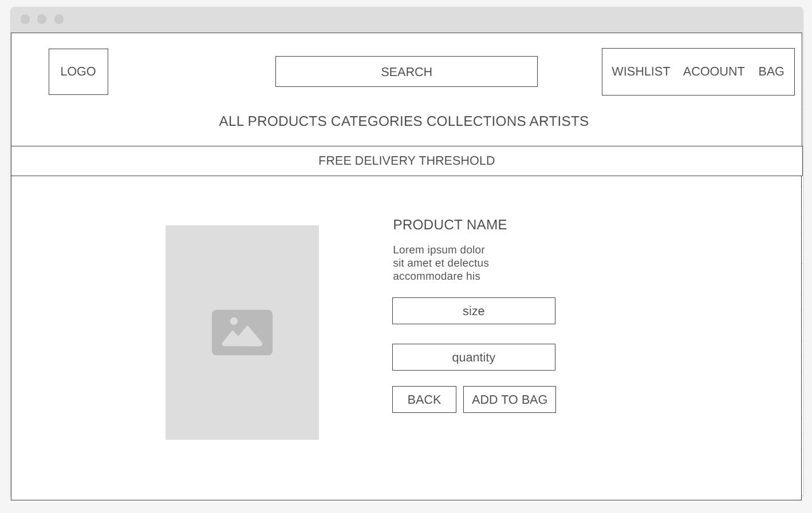

- Shopping Bag Page

    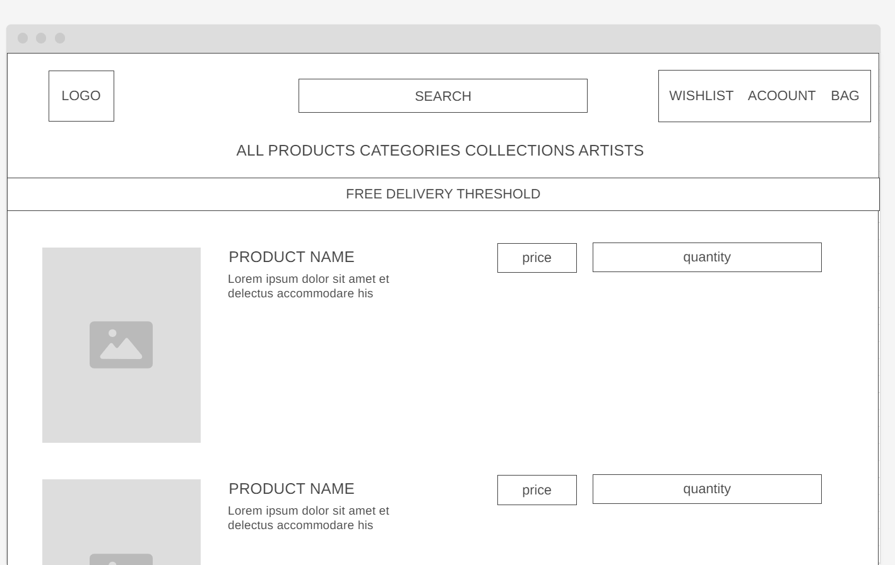

- Checkout Page

    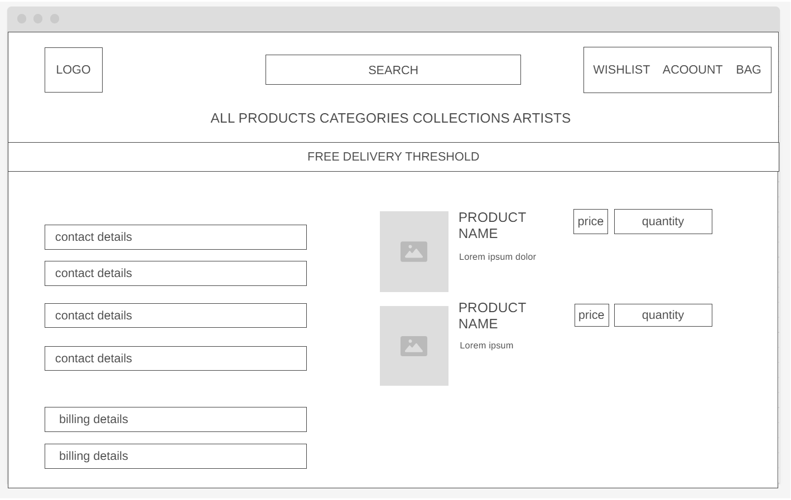

- Add Product Page

    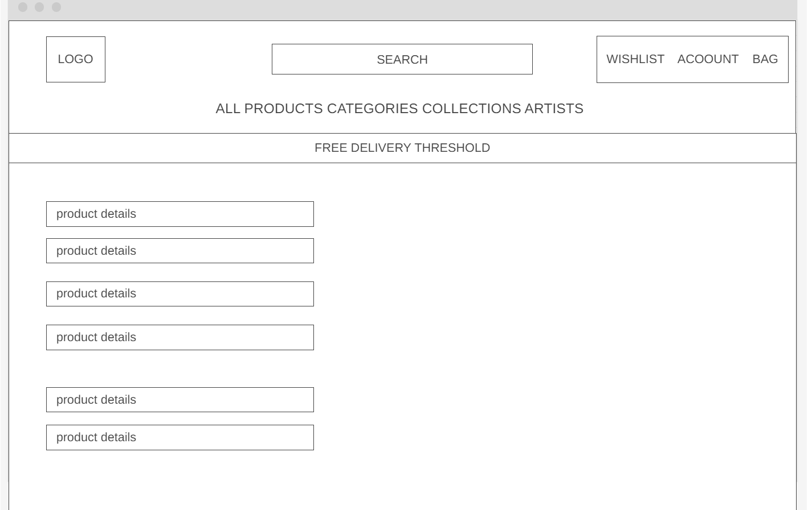

- Add Review Page

    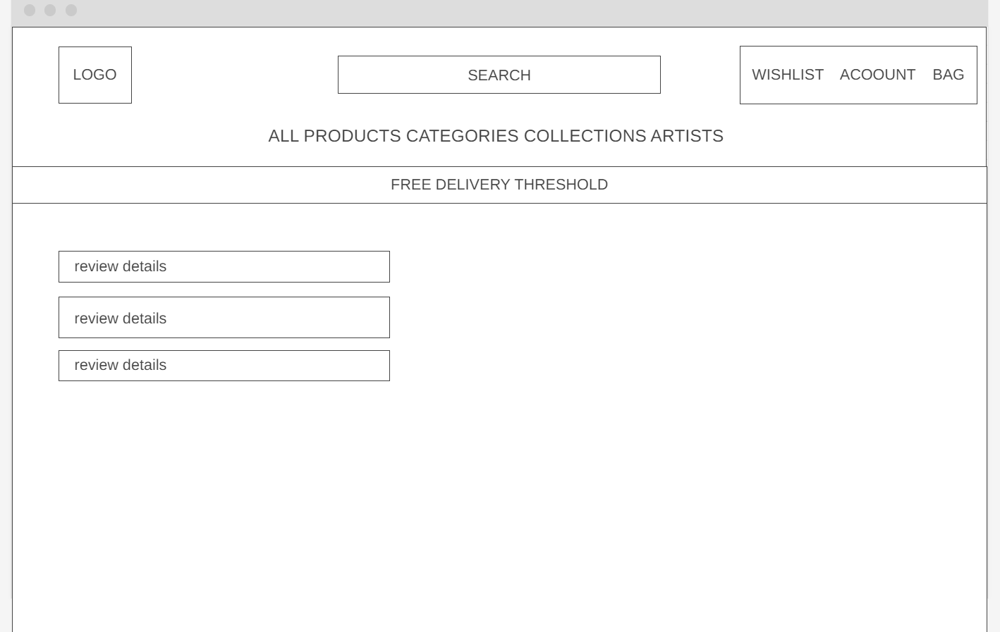

- Profile Page

    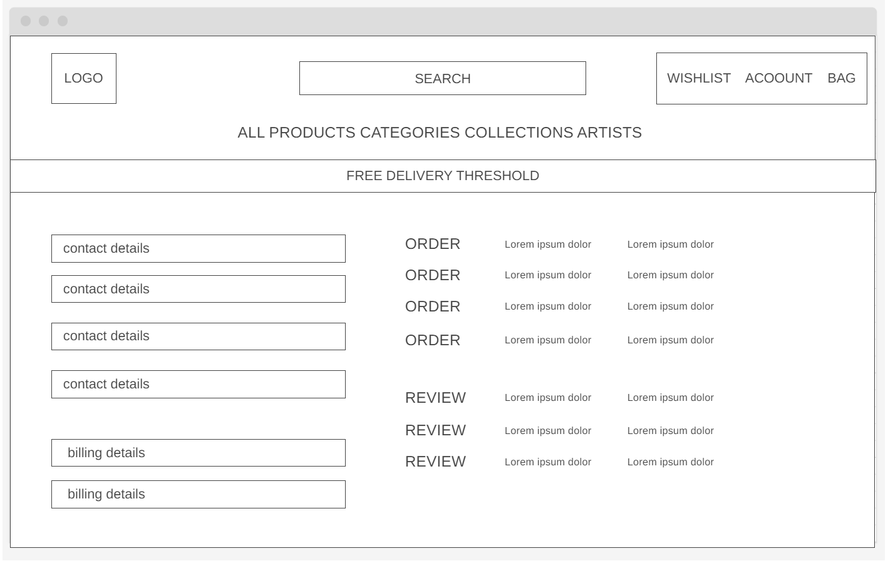

[Back to top](#contents)

## **Site Structure**

The project consists of 6 main apps handling everything from displaying products and their details (products app) to managing orders and handling online payments (bag and checkout app), to navigating through the user account (home and allauth), adding and managing reviews to products and adding them to a wishlist (wishlist app) for easy access in the future. 

[Back to top](#contents)

## **Design**

- *Typography*

    All text on the website is using a variation of the "Permanent Marker" and "Lato" font families found on Google Fonts - [Permanent Marker](https://fonts.google.com/specimen/Permanent+Marker?query=Perman) and Google Fonts - [Lato](https://fonts.google.com/specimen/Lato?query=lato).

- *Colour palette*

    The color palette chosen for the website consists of three main colors: Black, White, and Rebeccapurple. These colors create a bold and modern look, perfect for an e-commerce store focused on clothes.
    
    - Black: #222222
    - White: #FFFFFF
    - Rebeccapurple: #663399

The color palette chosen for the website consists of three main colors: Black, White, and Rebeccapurple. These colors create a bold and modern look, perfect for an e-commerce store focused on clothes.

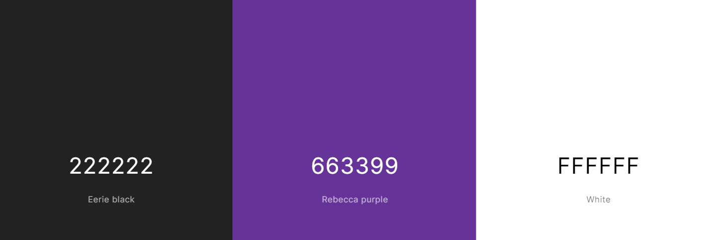

[Back to top](<#contents>)

# **Features**

The Guilty Sheep wesite is designed to be simple to navigate and easy to use.

## **Existing features**

- ### **Navigation Menu**

    Can be found on the side of all pages of the website pages below the logo. Makes navigation through pages easy and intuitive.
    The navigation menu is fully responsive to accomodate users of all decvces. The navigation menu inclued a search bar where a user can search products by naem or description, links with which they can sort and filter products, a link to their current shopping bag or wishlist, as well as links to their acocunt and in case of an admin user to Product Management pages

    - *Navigation Menu*

        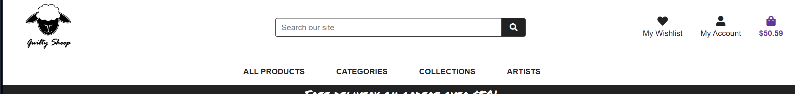

- ### **User Profiles**

    Users can create a personalized profile on Guilty Sheep by registering with a unique username and password. This feature is enabled through authauth and allowes users to access exclusive content, such as the CRUD functionality for product reviews or the auto fill of billing info when in checkout. The login interface allows existing users to securely sign in to their accounts, while the registration form enables new users to create an account by providing necessary details.

    - *login*

        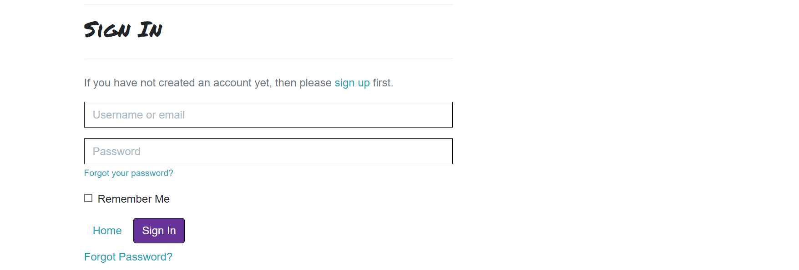

    - *Register*

        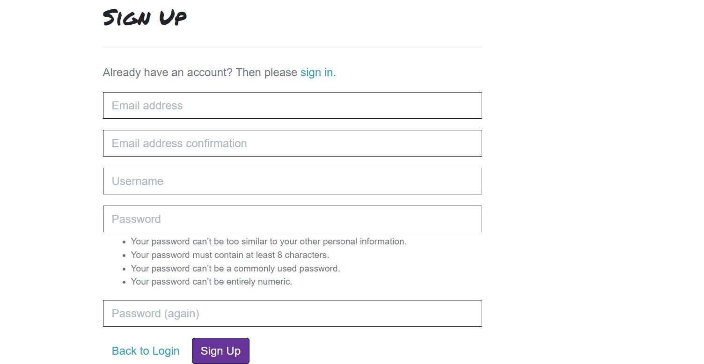
    
    - *Admin User*

        An admin user has access to an exclusive admin profile where they can monitor all reviews made on the website. This includes the ability to view, edit, delete, and create reviews as necessary, providing comprehensive control over user-generated content.

        - *Admin*

            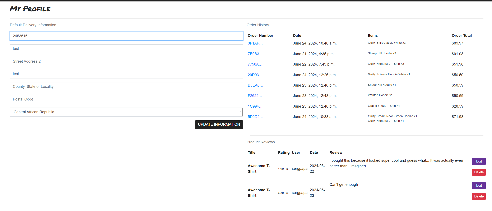
    
    - *Profile Page*

        - *Personalized Profile Page*

            Each user has their own personalized profile page where they can view and update their, look at past orders and manage their product reviews. This page serves as a centralized hub for users to manage and track their contributions to the platform.
        
        - *Review Details and Edit Mode*

            Users have the ability to access additional details and enter edit mode for each review. By clicking on a specific review entry, users are redirected to the update review page. Here, they can update their review details.

- ### **Product Listing and Details**

    Users can browse through a list of products to explore available items. Each product listing displays a thumbnail image, product name, price, and a brief description. Users can click on any product to view more detailed information.

    - *Products Page*

        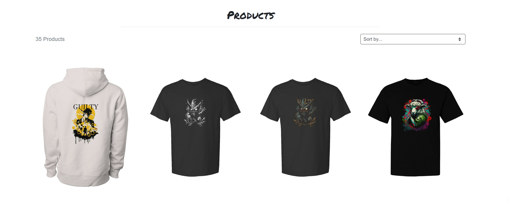
        
    - *Product Details Page*

        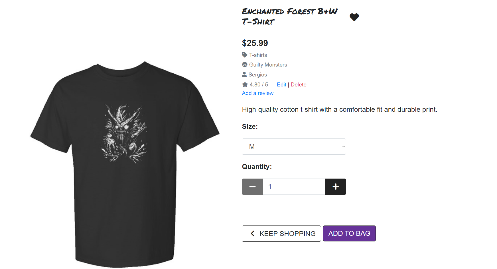

- ### **Categories and Collections**

    Users can filter products by specific categories, collections, or artists. This allows users to easily find products that suit their preferences. Each category or collection page showcases a curated list of relevant products.

- ### **Shopping Bag**

    Users can view items in their shopping bag to review their selections before checkout. The shopping bag displays a summary of selected items, including product images, names, quantities, and prices. Users can adjust quantities or remove items as needed.

    - *Shopping Bag*

        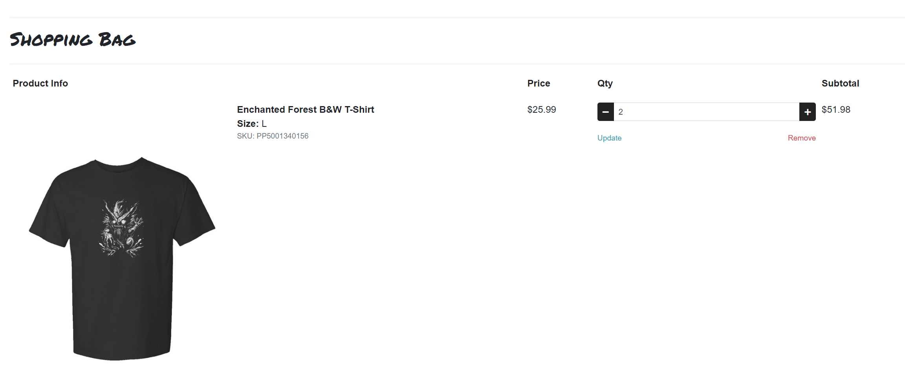

- ### **Wishlist**

    Users can add items in their wishlist for future reference. They can access their wishlist anythime from the navigation. Here, they can add their favorite products to their bag, in the size and quantity they wish.

    - *Wishlist*

        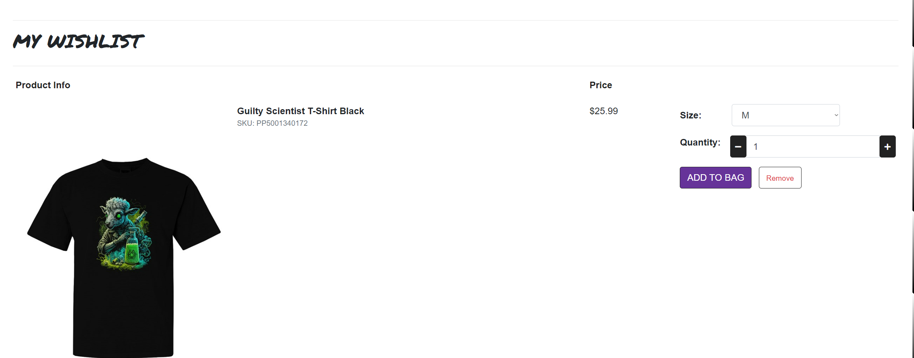

- ### **Checkout Process**

    Users can use Stripe to securely enter their payment information to complete their purchase. The checkout process includes steps for billing and shipping information, payment details, and order review. Users receive an order confirmation on the site and via email once the purchase is completed.

    - *Checkout*

        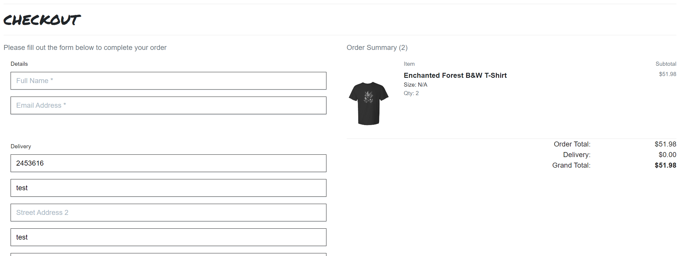

    - *Order Confirmation*

        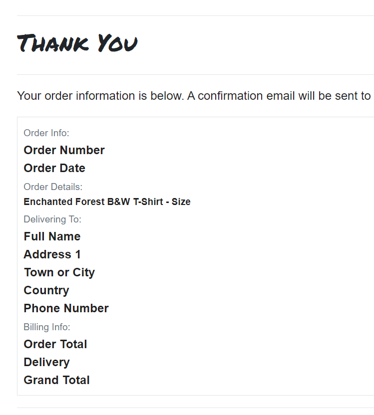

- ### **Search and Filter**

    Users can search for products by keywords using the search bar. They can also sort products by various criteria (e.g., price, popularity) and filter products based on attributes (e.g., size, color). These features help users quickly locate specific items and narrow down their choices.

    - *Search Bar*

        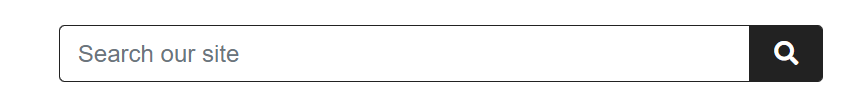

- ### **User Reviews**

    Users can add reviews for products they have purchased. Reviews include a rating and written feedback. Users can view a list of their reviews in their profile, and they have the option to edit or delete their reviews.

    - *Add Review*

        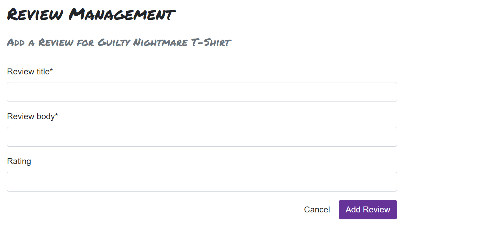

- ### **Admin Product Management**

    Admin users have access to product management features where they can add, edit, and delete products. This ensures that the product listings are up-to-date and accurate. Admins can also manage user reviews to maintain a positive user experience.

    - *Product Management*

        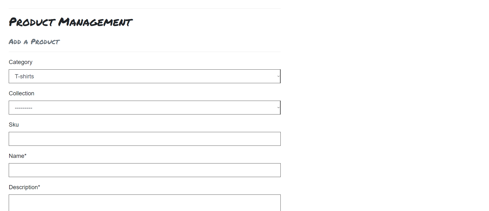

# **Technologies Used**

- [Python](https://www.python.org) - backend
- [Django](https://www.djangoproject.com) - templating framework
- [ElephantSQL](https://www.elephantsql.com) - database
- [HTML5](https://html.spec.whatwg.org) - content and structure of the website via templating
- [CSS3](https://www.w3.org/Style/CSS/Overview.en.html) - styling
- [JavaScript](https://www.w3schools.com/js/) - browser functionality
- [Stripe](https://stripe.com/en-gr) -  online payments
- [Wireframe.cc](https://wireframe.ccm) - wireframes
- [GitHub](https://github.com) - hosting and storing
- [Heroku](dashboard.heroku.com) - deployment
- [Gitpod](https://gitpod.io/) - coding workspace
- [GIMP](https://www.gimp.org) - image editing
  
[Back to top](<#contents>)

# **Testing**

Please follow this [link](./TESTING.md) to learn more about testing Guilty Sheep.

[Back to top](<#contents>)

# **Deployment**

### **Project Deployment Instructions**

This website is deployed on Heroku. Follow these steps to deploy the project:

- **Local Setup**

    - **Clone the Project:** 
        - Log in to GitHub, navigate to the repository, and click on the "Code" button. Select "Open with GitHub Desktop" and follow the instructions to clone the repository locally.
    - **Install Requirements:** 
        - In your local workspace, open a terminal window and navigate to the project directory.
        - Use the command `pip3 install -r requirements.txt` to install all necessary dependencies.
    - **Set Up MongoDB:** 
        - Sign up or log in to your MongoDB account. 
        - Create a cluster and a database, then create the necessary collections: products, categories, users, orders, and reviews. 
        - Populate these collections with the appropriate data according to the project's information architecture.
    - **Create Environment Variables:**
        - Create a `.gitignore` file in the project's root directory.
        - Add `env.py` to the `.gitignore`.
        - Create the `env.py` file and define the required environment variables using the `os` module.
    - **Run the App:** 
        - In your terminal window, run the command `python3 app.py` to start the application locally.

- **Heroku Deployment:** 

    - **Set Up Local Workspace for Heroku:**
        - Generate `requirements.txt` by running `pip3 freeze --local > requirements.txt`.
        - Create a `Procfile` specifying the entry point for Heroku using the command `echo web: python app.py > Procfile`.
    
    - **Set Up Heroku:**
        - Create a Heroku account and a new app, selecting your preferred region.
        - Choose the "GitHub" deployment method and connect your repository to Heroku.
    
    - **Configure Environment Variables:**
        - In Heroku, navigate to the app's settings and find "Config Vars."
        - Enter the variables from your `env.py` file: `AWS_ACCESS_KEY_ID`, `AWS_SECRET_ACCESS_KEY`, `DATABASE_URL`, `EMAIL_HOST_PASS`, `EMAIL_HOST_USER`, `SECRET_KEY`, `STRIPE_PUBLIC_KEY`, `STRIPE_SECRET_KEY`, `STRIPE_WH_SECRET` and `USE_AWS`.
    
    - **Push Files to Repository:**
        - Add and commit `requirements.txt` and `Procfile` to your Git repository.
    
    - **Automatic Deployment:**
        - In the Heroku dashboard, go to the deploy tab and enable automatic deployments.
        - Heroku will fetch the code from GitHub and deploy the app using the specified packages.
        - Click "Open app" to access the live version.

You can access the live link to the deployed version on Heroku - [https://guilty-sheep-d1a7abf9637c.herokuapp.com](https://guilty-sheep-d1a7abf9637c.herokuapp.com)

[Back to top](#contents)

# **Credits**

- Font: [Google Fonts](https://fonts.google.com)
- Icons: [Fontawesome](https://fontawesome.com)
- DB: [ElephantSQL](https://www.elephantsql.com)
- Electrinic Payments: [Stripe](https://stripe.com/en-gr)
- Wireframes: [Wireframe.cc](https://wireframe.cc)
- Image Editing: [GIMP 2.10.34](https://www.gimp.org)
- Color Palette: [Coolors](https://coolors.co)
- Web storage: [AWS](https://aws.amazon.com/?nc2=h_lg)

[Back to top](<#contents>)

# **Acknowledgements**

This website was developed as a part of my Portfolio 4 Project for the Web Application Developemnt Diploma at the [Code Institute](https://codeinstitute.net/). I want to express my gratitude to my mentor, [Precious Ijege](https://www.linkedin.com/in/precious-ijege-908a00168/), as well as the Slack community and everyone at the Code Institute for their valuable assistance and support throughout this project.

Sergios Papastergiou
2024
