# **TESTING**

The Guilty Sheep website has been tested manually as well as with automated services like code validators and browser developer tools.

# **Contents**

- [**TESTING**](#testing)
- [**Contents**](#contents)
  - [**Code Validators**](#code-validators)
    - [*w3schools HTML Validator*](#w3schools-html-validator)
    - [*w3schools CSS Validator*](#w3schools-css-validator)
    - [*JsHint JavasScript Validator*](#jshint-javasscript-validator)
  - [**Features Testing**](#features-testing)
  - [**Responsiveness Test**](#responsiveness-test)
  - [**Browser Compatibility**](#browser-compatibility)
  - [**Testing User Stories**](#testing-user-stories)
  - [**Perofrmance**](#perofrmance)
    - [**User Profiles**](#user-profiles)
    - [**Movie Card**](#movie-card)
    - [**Header and Footer**](#header-and-footer)
  - [**Known Bugs**](#known-bugs)
    - [**Resolved**](#resolved)
  - [**Additional Testing**](#additional-testing)
    - [**Lighthouse**](#lighthouse)
  
## **Code Validators**

### *[w3schools HTML Validator](https://validator.w3.org)*

- [Home Page](https://guilty-sheep-d1a7abf9637c.herokuapp.com)
  
  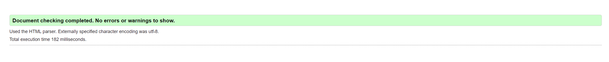

- [Products Page](https://guilty-sheep-d1a7abf9637c.herokuapp.com/products/)
  
  

- [Product Details Page](https://guilty-sheep-d1a7abf9637c.herokuapp.com/products/2/)
  
  

- [Shopping Bag Page](https://guilty-sheep-d1a7abf9637c.herokuapp.com/bag/)
  
  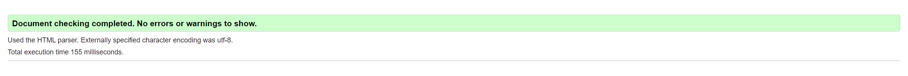

- [Checkout Page](https://guilty-sheep-d1a7abf9637c.herokuapp.com/checkout/)
  
  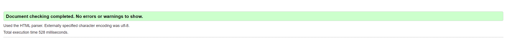

- [Checkout Success Page](https://guilty-sheep-d1a7abf9637c.herokuapp.com/checkout/checkout_success/433D177B9E6B4ECF8D073990C3F1FF43)
  
  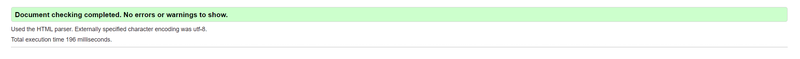

- [Wishlist Page](https://guilty-sheep-d1a7abf9637c.herokuapp.com/wishlist/)
  
  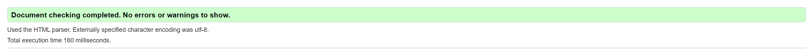

- [Add Product Page](https://guilty-sheep-d1a7abf9637c.herokuapp.com/products/add/)
  
  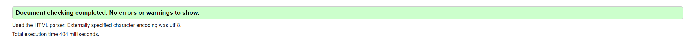

- [Edit Product Page](https://guilty-sheep-d1a7abf9637c.herokuapp.com/products/edit/29/)
  
  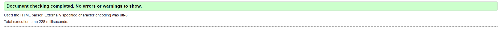

- [Add Review Page](https://guilty-sheep-d1a7abf9637c.herokuapp.com/products/review/add/25/)
  
  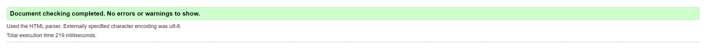

- [Edit Review Page](https://guilty-sheep-d1a7abf9637c.herokuapp.com/products/review/edit/1/)
  
  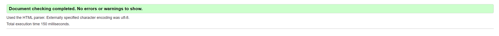

- [Profile Page](https://guilty-sheep-d1a7abf9637c.herokuapp.com/profile/)
  
  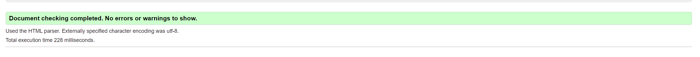

### *[w3schools CSS Validator](https://jigsaw.w3.org/css-validator/)*

### *[JsHint JavasScript Validator](https://jshint.com)*

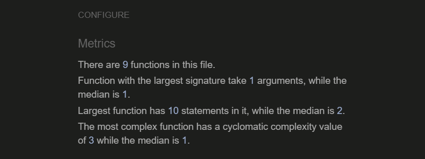

[Back to top](#contents)

## **Features Testing**

- ### Navigation Menu
  
    Expected: The feature is expected to redirect to the various website pages.
    Testing: Tested the feature by clicking each link manually and examining the result.
    Result: The feature acted as expected and redirected to other pages.

- ### User Profiles
    - Feature 1: Registration

        Expected: Users should be able to create a personalized profile by registering with a unique username and password.
        Testing: Attempted to register as a new user by providing necessary details such as username, email, and password through the registration form.
        Result: Successfully registered as a new user and was redirected to the login page.

    - Feature 2: Login

        Expected: Existing users should be able to securely sign in to their accounts using their credentials.
        Testing: Entered valid login credentials (username and password) into the login form and attempted to sign in.
        Result: Successfully logged in and was redirected to the user dashboard.

    - Feature 3: Admin Access

        Expected: Admin users should have access to an exclusive admin profile with additional functionalities.
        Testing: Attempted to sign in as an admin user and verified access to admin-exclusive functionalities.
        Result: Successfully accessed the admin profile with privileges to monitor, edit, delete, and create products and reviews.

    - Feature 4: Profile Page

        Expected: Each user should have a personalized profile page where they can view and update their information, look at past orders, and manage their product reviews.
        Testing: Navigated to the profile page after logging in and checked the available functionalities.
        Result: The profile page displayed user information, past orders, and options to manage product reviews as expected.

- ### Product Listing and Details
  
    Expected: Users should be able to browse through a list of products and view detailed information for each product.
    Testing: Navigated through the product listings and clicked on individual products to view details.
    Result: Product listings and details displayed correctly with relevant information.
    
- ### Categories, Collections and Aritists
  
    Expected: Users should be able to filter products by specific categories, collections, or artists.
    Testing: Selected various categories and collections to check the filtered product listings.
    Result: Products were correctly filtered and displayed according to the selected category, collection or artist.
    
- ### Shopping Bag and Wishlist
    - Feature 1: Shopping Bag

        Expected: Users should be able to view items in their shopping bag and review their selections before checkout.
        Testing: Added items to the shopping bag and reviewed the contents.
        Result: Shopping bag displayed the selected items with options to adjust quantities or remove items.
    
    - Feature 1: Wishlist

        Expected: Users should be able to add products to a wishlist for future reference.
        Testing: Added items to the wishlist and checked the wishlist page.
        Result: Wishlist displayed the added products and provided options to move items to the shopping bag.
    
- ### Checkout Process
  
    Expected: Users should be able to securely enter their payment information and complete their purchase.
    Testing: Proceeded through the checkout process by entering billing and shipping information, payment details, and reviewing the order.
    Result: Checkout process completed successfully with order confirmation displayed on the site and sent via email.
    
- ### Search and Filter
    - Feature 1: Search

        Expected: Users should be able to search for products by keywords.
        Testing: Entered various keywords into the search bar to locate specific items.
        Result: Search results displayed relevant products matching the keywords.

    - Feature 2: Filter

        Expected: Users should be able to sort products by various criteria (e.g., price, popularity) and filter based on attributes (e.g., size, color).
        Testing: Applied different sorting and filtering options to the product listings.
        Result: Products were correctly sorted and filtered according to the selected criteria and attributes.
    
- ### User Reviews
    - Feature 1: Add Review

        Expected: Users should be able to add reviews for products they have purchased.
        Testing: Submitted reviews for various products.
        Result: Reviews were successfully added and displayed on the product pages.

    - Feature 2: Manage Reviews

        Expected: Users should be able to view a list of their reviews, and edit or delete them as necessary.
        Testing: Checked the list of reviews in the user profile and edited or deleted some reviews.
        Result: Reviews were correctly displayed, and edits or deletions were successfully applied.
    
- ### Admin Product Management
    - Feature 1: Manage Products

        Expected: Admin users should be able to add, edit, and delete products.
        Testing: Used the admin interface to perform CRUD operations on products.
        Result: Products were successfully managed with changes reflected on the website.

    - Feature 2: Manage Reviews

        Expected: Admin users should be able to manage user reviews to maintain a positive user experience.
        Testing: Accessed the admin review management interface to moderate reviews.
        Result: Reviews were successfully managed with options to approve, edit, or delete as needed

- ## Perofrmance 

    |         |**Home**|**Products**| **Product Details**| **Shopping Bag**| **Chekout** | **Profile** | **Manage Products** | **Manage Reviews** |
    |---------|---------|-------------|--------|----------|------------|------------|------------|------------|
    |  Buttons |   Pass  |   Pass    |  Pass   |   Pass   |    Pass    |   Pass   |    Pass    |   Pass   |
    |  Links |   Pass  |   Pass    |  Pass   |   Pass   |    Pass    |   Pass   |    Pass    |   Pass   |
    |  Images |   Pass  |   Pass    |  Pass   |   Pass   |    Pass    |   Pass   |    Pass    |   Pass   |
    |  Nav Links |   Pass  |   Pass    |  Pass   |   Pass   |    Pass    |   Pass   |    Pass    |   Pass   |
    |  CRUD Products |   Pass  |   Pass    |  Pass   |   Pass   |    Pass    |   Pass   |    Pass    |   Pass   |
    |  CRUD Reviews |   Pass  |   Pass    |  Pass   |   Pass   |    Pass    |   Pass   |    Pass    |   Pass   |

## **Responsiveness Test**

Responsiveness tests were carried out manually with a combination of device testing and [Google Chrome Developer Tools](https://developer.chrome.com/docs/devtools/).
    

|         |**iPhone 11**|**Samsung Galaxy S8+**| **Pixel 5**|**iPad Mini**|**iPad Air**|**iPad Pro**|**Display <1200px**|**Display >1200px**|
|---------|-------------|----------------------|------------|-------------|------------|------------|-------------------|-------------------|
|  Render |   Pass      |       Pass           |  Pass      |    Pass     |   Pass     |  Pass      | Pass              |      Pass         |
|  Images |   Pass      |       Pass           |  Pass      |    Pass     |   Pass     |  Pass      | Pass              |      Pass         |
|  Links  |   Pass      |       Pass           |  Pass      |    Pass     |   Pass     |  Pass      | Pass              |      Pass         |

[Back to top](#contents)

## **Browser Compatibility**

Guilty Sheep has been tested in multiple browsers with no visible issues. Google Chrome, Mozilla Firefox, Safari, Microsoft Edge and Opera.Appearance, functionality and responsiveness were found consistent throughout on a range of device sizes and browsers.

[Back to top](#contents)

# **Testing User Stories**

- ## Viewing and Navigation

    - As a user, I want to view a list of products, so I can browse through available items.

        Expected: Users should be able to see a list of products.
        Testing: Navigated to the product listing page.
        Result: Successfully displayed a list of products.

    - As a user, I want to view a specific category, collection, or artist, so I can find products that suit my preferences.

        Expected: Users should be able to filter products by category, collection, or artist.
        Testing: Applied filters to view specific categories, collections, or artists.
        Result: Products filtered correctly based on the selected criteria.
    
    - As a user, I want to view individual product details, so I can learn more about the item before purchasing.

        Expected: Users should be able to view detailed information about a product.
        Testing: Clicked on individual products to view their details.
        Result: Detailed product information displayed correctly.

    - As a user, I want to view the total of my purchases at any time, so I can keep track of my spending.

        Expected: Users should be able to see the total amount of their purchases.
        Testing: Added items to the shopping bag and viewed the total amount.
        Result: Total purchase amount displayed correctly in the shopping bag.

- ## Registration and User Access

    - As a new user, I want to easily register, so I can create an account and start shopping.

        Expected: Users should be able to register by providing necessary details.
        Testing: Filled out the registration form and submitted it.
        Result: Successfully registered and redirected to the login page.

    - As a returning user, I want to log in or log out effortlessly, so I can access my account securely.

        Expected: Users should be able to log in and log out easily.
        Testing: Logged in with valid credentials and logged out.
        Result: Successfully logged in and logged out.
        
    - As a user, I want to recover my password if forgotten, so I do not lose access to my account.

        Expected: Users should be able to recover their password.
        Testing: Attempted to recover password through the forgot password link.
        Result: Password recovery process worked as expected.
        
    - As a user, I want to receive an email confirmation upon registration, so I know that my account has been successfully created.

        Expected: Users should receive an email confirmation after registering.
        Testing: Registered a new account and checked the email for confirmation.
        Result: Email confirmation received successfully.

    - As a user, I want a personalized user profile, so I can view and manage my account details and purchase history.

        Expected: Users should have a personalized profile page.
        Testing: Navigated to the profile page after logging in.
        Result: Personalized profile page displayed correctly with account details and purchase history.

- ## Sorting and Searching
    - As a user, I want to sort products by various criteria (e.g., price, popularity), so I can easily find what I am looking for.

        Expected: Users should be able to sort products by different criteria.
        Testing: Applied sorting options on the product listing page.
        Result: Products sorted correctly according to the selected criteria.

    - As a user, I want to filter products based on attributes (e.g., size, color), so I can narrow down my choices.

        Expected: Users should be able to filter products by various attributes.
        Testing: Applied different filters to the product listings.
        Result: Products filtered correctly based on the selected attributes.

    - As a user, I want to search for products by keywords, so I can quickly locate specific items.

        Expected: Users should be able to search for products using keywords.
        Testing: Used the search bar to find products by entering keywords.
        Result: Search results displayed relevant products matching the keywords.

- ## Purchasing and Checkout
    - As a user, I want to select a product, size, and quantity, so I can add the correct items to my cart.

        Expected: Users should be able to select product attributes and add items to their cart.
        Testing: Selected various products with specific sizes and quantities and added them to the cart.
        Result: Products added to the cart with the selected attributes.

    - As a user, I want to view items in my shopping bag, so I can review my selections before checkout.

        Expected: Users should be able to view and review items in their shopping bag.
        Testing: Viewed the shopping bag after adding products.
        Result: Shopping bag displayed the selected items correctly.

    - As a user, I want to adjust the quantity or remove items from my shopping bag, so I can modify my purchase as needed.

        Expected: Users should be able to adjust quantities or remove items in the shopping bag.
        Testing: Modified quantities and removed items from the shopping bag.
        Result: Changes to the shopping bag were applied correctly.

    - As a user, I want to enter my payment information securely, so I can complete my purchase.

        Expected: Users should be able to enter payment information securely.
        Testing: Entered payment information during checkout.
        Result: Payment information entered securely and purchase completed.
        
    - As a user, I want to see an order confirmation on the site and receive an email confirmation, so I know my order has been successfully placed.

        Expected: Users should receive an order confirmation on the site and via email.
        Testing: Completed a purchase and checked for order confirmation.
        Result: Order confirmation displayed on the site and received via email.

- ## Wishlisting Products
    - As a user, I want to wishlist a product that I wish to buy in the future, so I can easily access it later.

        Expected: Users should be able to add products to a wishlist.
        Testing: Added various products to the wishlist.
        Result: Products successfully added to the wishlist.

    - As a user, I want to see a list of my wishlisted items, so I can keep track of the products I plan to buy.

        Expected: Users should be able to view their wishlist.
        Testing: Navigated to the wishlist page.
        Result: Wishlist displayed the added items correctly.

    - As a user, I want to manage my wishlisted items (edit or delete), so I can update or remove any product as necessary.

        Expected: Users should be able to edit or delete items in their wishlist.
        Testing: Edited and deleted items from the wishlist.
        Result: Wishlist items managed correctly.

    - As a user, I want to easily add products from my wishlist to my bag, so I can buy them when I am ready.

        Expected: Users should be able to move items from the wishlist to the shopping bag.
        Testing: Moved items from the wishlist to the shopping bag.
        Result: Items successfully moved to the shopping bag.

- ## Reviewing Products
    - As a user, I want to add a review for a product, so I can share my experience with other customers.

        Expected: Users should be able to add reviews for products.
        Testing: Submitted reviews for purchased products.
        Result: Reviews successfully added and displayed on product pages.

    - As a user, I want to see a list of my reviews in my profile, so I can keep track of the products I have reviewed.

        Expected: Users should be able to view their reviews in their profile.
        Testing: Checked the reviews section in the user profile.
        Result: Reviews displayed correctly in the profile.

    - As a user, I want to manage my reviews (edit or delete), so I can update or remove my feedback as necessary.

        Expected: Users should be able to edit or delete their reviews.
        Testing: Edited and deleted reviews from the user profile.
        Result: Reviews managed correctly.

- ## Admin and Moderation
    - As an admin, I want to manage products (add, edit, delete), so I can keep the product listings up to date.

        Expected: Admins should be able to perform CRUD operations on products.
        Testing: Added, edited, and deleted products using the admin interface.
        Result: Products managed correctly with changes reflected on the website.

    - As an admin, I want to manage reviews, so I can moderate content and ensure a positive user experience.

        Expected: Admins should be able to manage user reviews.
        Testing: Moderated reviews using the admin interface.
        Result: Reviews managed successfully with options to approve, edit, or delete.

    - As an admin, I want to access a special admin profile with additional functionalities, so I can perform my duties effectively.

        Expected: Admins should have access to an exclusive admin profile.
        Testing: Logged in as an admin user and accessed admin-exclusive functionalities.
        Result: Admin profile accessed successfully with additional privileges.

[Back to top](#contents)

## **Known Bugs**

### **Resolved**

- *Django Wrong Default Value - Migrate*

    Sometimes when making changes to models and try to migrate you get a prompt to enter a default value to be applied to pre-existing db items even if you have deleted them through the admin platform. This is likely cause due to initial mogrations having differnet configurations the bd tables.
    if in this case a wrong value is entered it can still be accepted by Django (such as timezone.now() to a non date field). This causes the admin table to break and the user is unable to access it.

    *Solution:*

    The only solution that was identified was to scratch the db and recreated as access to the db was impossible as well as deleting the object from the shell (since previous objects have already been deleted)

    Another possible solution could be to delete all previous migrations and fake init new migrations. With this command django diregards any previous migrations and starts building your db presummable fixing the issue.

### **Lighthouse**

The website has been tested using [Google Lighthouse](https://developer.chrome.com/docs/lighthouse/overview/) to test individual pages on:

- Performance - how does the page perform on loading?
- Accessibility - is the website accessible to all users?
- Best Practices - Does the code follow best practices?
- SEO - Is the pages optimized for search engines?

  Results varied depending on browser, but wesite maintained an over 80% score on all browsers and all pages. An example of the Lighthouse results on Opera Browser at the Guilty Sheep movie card page is shown below:

  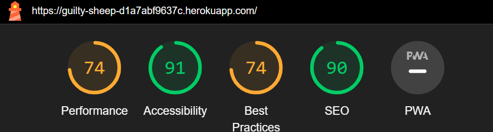

Back to [README.md](./README.md#testing).
