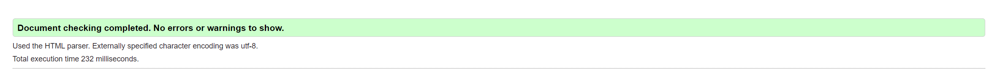

# **TESTING**

The Guilty Sheep website has been tested manually as well as with automated services like code validators and browser developer tools.

# **Contents**

- [**TESTING**](#testing)
- [**Contents**](#contents)
  - [**Code Validators**](#code-validators)
    - [*w3schools HTML Validator*](#w3schools-html-validator)
    - [*w3schools CSS Validator*](#w3schools-css-validator)
    - [*JsHint JavasScript Validator*](#jshint-javasscript-validator)
  - [**Features Testing**](#features-testing)
  - [**Responsiveness Test**](#responsiveness-test)
  - [**Browser Compatibility**](#browser-compatibility)
  - [**Testing User Stories**](#testing-user-stories)
  - [**Perofrmance**](#perofrmance)
    - [**User Profiles**](#user-profiles)
    - [**Movie Card**](#movie-card)
    - [**Header and Footer**](#header-and-footer)
  - [**Known Bugs**](#known-bugs)
    - [**Resolved**](#resolved)
  - [**Additional Testing**](#additional-testing)
    - [**Lighthouse**](#lighthouse)
  
## **Code Validators**

### *[w3schools HTML Validator](https://validator.w3.org)*

- [Home Page](https://guilty-sheep-d1a7abf9637c.herokuapp.com)
  
  

- [Products Page](https://guilty-sheep-d1a7abf9637c.herokuapp.com/products/)
  
  

- [Product Details Page](https://guilty-sheep-d1a7abf9637c.herokuapp.com/products/2/)
  
  

- [Shopping Bag Page](https://guilty-sheep-d1a7abf9637c.herokuapp.com/bag/)
  
  

- [Checkout Page](https://guilty-sheep-d1a7abf9637c.herokuapp.com/checkout/)
  
  

- [Checkout Success Page](https://guilty-sheep-d1a7abf9637c.herokuapp.com/checkout/checkout_success/433D177B9E6B4ECF8D073990C3F1FF43)
  
  

- [Wishlist Page](https://guilty-sheep-d1a7abf9637c.herokuapp.com/wishlist/)
  
  

- [Add Product Page](https://guilty-sheep-d1a7abf9637c.herokuapp.com/products/add/)
  
  

- [Edit Product Page](https://guilty-sheep-d1a7abf9637c.herokuapp.com/products/edit/29/)
  
  

- [Add Review Page](https://guilty-sheep-d1a7abf9637c.herokuapp.com/products/review/add/25/)
  
  

- [Edit Review Page](https://guilty-sheep-d1a7abf9637c.herokuapp.com/products/review/edit/1/)
  
  

- [Profile Page](https://guilty-sheep-d1a7abf9637c.herokuapp.com/profile/)
  
  

### *[w3schools CSS Validator](https://jigsaw.w3.org/css-validator/)*

### *[JsHint JavasScript Validator](https://jshint.com)*

[Back to top](#contents)

## **Features Testing**

- ### Navigation Menu
  
    Expected: The feature is expected to redirect to the various website pages.
    Testing: Tested the feature by clicking each link manually and examining the result.
    Result: The feature acted as expected and redirected to other pages.

- ### User Profiles
    - Feature 1: Registration

        Expected: Users should be able to create a personalized profile by registering with a unique username and password.
        Testing: Attempted to register as a new user by providing necessary details such as username, email, and password through the registration form.
        Result: Successfully registered as a new user and was redirected to the login page.

    - Feature 2: Login

        Expected: Existing users should be able to securely sign in to their accounts using their credentials.
        Testing: Entered valid login credentials (username and password) into the login form and attempted to sign in.
        Result: Successfully logged in and was redirected to the user dashboard.

    - Feature 3: Admin Access

        Expected: Admin users should have access to an exclusive admin profile with additional functionalities.
        Testing: Attempted to sign in as an admin user and verified access to admin-exclusive functionalities.
        Result: Successfully accessed the admin profile with privileges to monitor, edit, delete, and create products and reviews.

    - Feature 4: Profile Page

        Expected: Each user should have a personalized profile page where they can view and update their information, look at past orders, and manage their product reviews.
        Testing: Navigated to the profile page after logging in and checked the available functionalities.
        Result: The profile page displayed user information, past orders, and options to manage product reviews as expected.

- ### Product Listing and Details
  
        Expected: Users should be able to browse through a list of products and view detailed information for each product.
        Testing: Navigated through the product listings and clicked on individual products to view details.
        Result: Product listings and details displayed correctly with relevant information.
    

- ### Categories, Collections and Aritists
  
        Expected: Users should be able to filter products by specific categories, collections, or artists.
        Testing: Selected various categories and collections to check the filtered product listings.
        Result: Products were correctly filtered and displayed according to the selected category or collection.
    

- ### Shopping Bag and Wishlist
    - Feature 1: Shopping Bag

        Expected: Users should be able to view items in their shopping bag and review their selections before checkout.
        Testing: Added items to the shopping bag and reviewed the contents.
        Result: Shopping bag displayed the selected items with options to adjust quantities or remove items.
    
    - Feature 1: Wishlist

        Expected: Users should be able to add products to a wishlist for future reference.
        Testing: Added items to the wishlist and checked the wishlist page.
        Result: Wishlist displayed the added products and provided options to move items to the shopping bag.
    
- ### Checkout Process
  
        Expected: Users should be able to securely enter their payment information and complete their purchase.
        Testing: Proceeded through the checkout process by entering billing and shipping information, payment details, and reviewing the order.
        Result: Checkout process completed successfully with order confirmation displayed on the site and sent via email.
    
- ### Search and Filter
    - Feature 1: Search

        Expected: Users should be able to search for products by keywords.
        Testing: Entered various keywords into the search bar to locate specific items.
        Result: Search results displayed relevant products matching the keywords.

    - Feature 2: Filter

        Expected: Users should be able to sort products by various criteria (e.g., price, popularity) and filter based on attributes (e.g., size, color).
        Testing: Applied different sorting and filtering options to the product listings.
        Result: Products were correctly sorted and filtered according to the selected criteria and attributes.
    
- ### User Reviews
    - Feature 1: Add Review

        Expected: Users should be able to add reviews for products they have purchased.
        Testing: Submitted reviews for various products.
        Result: Reviews were successfully added and displayed on the product pages.

    - Feature 2: Manage Reviews

        Expected: Users should be able to view a list of their reviews, and edit or delete them as necessary.
        Testing: Checked the list of reviews in the user profile and edited or deleted some reviews.
        Result: Reviews were correctly displayed, and edits or deletions were successfully applied.
    
- ### Admin Product Management
    - Feature 1: Manage Products

        Expected: Admin users should be able to add, edit, and delete products.
        Testing: Used the admin interface to perform CRUD operations on products.
        Result: Products were successfully managed with changes reflected on the website.

    - Feature 2: Manage Reviews

        Expected: Admin users should be able to manage user reviews to maintain a positive user experience.
        Testing: Accessed the admin review management interface to moderate reviews.
        Result: Reviews were successfully managed with options to approve, edit, or delete as needed

- ## Perofrmance 

    |         |**Movie List**|**Movie Card**| **Profile Page**| **Profile Page**| **Add Movie** |
    |---------|-------------|----------------------|------------|------------|------------|
    |  Buttons |   Pass      |       Pass           |  Pass      |   Pass      |    Pass      |
    |  Links  |   Pass      |       Pass           |  Pass      |  Pass      |   Pass      |
    |  Images  |   Pass      |       Pass           |  Pass      |  Pass      |   Pass      |
    |  Nav Links | Pass  | Pass | Pass |  Pass      |   Pass      |
    |  CREATE review | Pass  | Pass | Pass |  Pass      |   Pass      |
    |  READ review | Pass  | Pass | Pass |  Pass      |   Pass      |
    |  UPDATE review | Pass  | Pass | Pass |  Pass      |   Pass      |
    |  DELETE review | Pass  | Pass | Pass |  Pass      |   Pass      |
    |  API calls | Pass  | Pass | Pass |  Pass      |   Pass      |

## **Responsiveness Test**

Responsiveness tests were carried out manually with a combination of device testing and [Google Chrome Developer Tools](https://developer.chrome.com/docs/devtools/).
    

|         |**iPhone 11**|**Samsung Galaxy S8+**| **Pixel 5**|**iPad Mini**|**iPad Air**|**iPad Pro**|**Display <1200px**|**Display >1200px**|
|---------|-------------|----------------------|------------|-------------|------------|------------|-------------------|-------------------|
|  Render |   Pass      |       Pass           |  Pass      |    Pass     |   Pass     |  Pass      | Pass              |      Pass         |
|  Images |   Pass      |       Pass           |  Pass      |    Pass     |   Pass     |  Pass      | Pass              |      Pass         |
|  Links  |   Pass      |       Pass           |  Pass      |    Pass     |   Pass     |  Pass      | Pass              |      Pass         |

[Back to top](#contents)

## **Browser Compatibility**

Guilty Sheep has been tested in multiple browsers with no visible issues. Google Chrome, Mozilla Firefox, Safari, Microsoft Edge and Opera.Appearance, functionality and responsiveness were found consistent throughout on a range of device sizes and browsers.

[Back to top](#contents)

# **Testing User Stories**

[Back to top](#contents)

## **Known Bugs**

### **Resolved**

### **Lighthouse**

The website has been tested using [Google Lighthouse](https://developer.chrome.com/docs/lighthouse/overview/) to test individual pages on:

- Performance - how does the page perform on loading?
- Accessibility - is the website accessible to all users?
- Best Practices - Does the code follow best practices?
- SEO - Is the pages optimized for search engines?

  Results varied depending on browser, but wesite maintained an over 80% score on all browsers and all pages. An example of the Lighthouse results on Opera Browser at the Guilty Sheep movie card page is shown below:

  

Back to [README.md](./README.md#testing).
